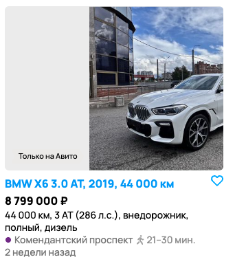
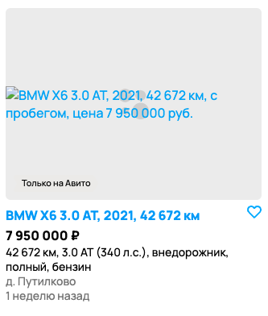

---
id: 1

Заголовок: Съехал badge

Описание: Badge должен находиться в левом нижнем углу картинки, но немного съехал

Приоритет: Low (серьёзность Trivia, c частотой Low -> приоритет низний )

---

---
id: 2

Заголовок: Неверный результат поиска

Описание: Автомобиль не соответствует запросу на поиск автомобилей BMW X6

Приоритет: High (серьёзность Minor (так как фильтр не коректно работает), c частотой High -> приоритет высокий )

---

---
id: 3

Заголовок: Отображение "Лобовое стекло Mercedes G63 AMG" среди результатов поиска автомобилей

Описание: Вместо автомобиля, под одним из результатов (левый нижний угол) показана запчасть — лобовое стекло, что не соответствует запросу на поиск автомобилей BMW X6.

Приоритет:High (серьёзность Minor (так как фильтр не коректно работает), c частотой High -> приоритет высокий )

---

---
id: 4

Заголовок: Съхала кнопка избранное

Описание: Кнопка добавить в избранное должно находиться справа снизу под картинкой напротив наименования обьявления

Приоритет: Medium (серьёзность Trivia или Major(елси кнопка стала не кликабельной), c частотой Low -> приоритет средний )

---

---
id: 5

Заголовок: Несоответствие фильтру поиск

Описание: В фильтре поиска были указаны автомобиль с 2021 по 2024, а автомобиль 2019 года выпуска

Приоритет: Medium (серьёзность Major (так как фильтр не коректно работает), c частотой medium -> приоритет средний )

---

---
id: 6

Заголовок: Фото автомобиля не загрузилась

Описание: Фото автомобиля не загрузилось

Приоритет: High (серьёзность Major (не помугт отрыть пост по картинке но смогут по наименаванию), c частотой high -> приоритет высокий )

---

---
id: 7

Заголовок: Ошибка фильтра поиска

Описание: В фильтре поиска было выбрано что машина полноприводная но на обьявление передний привод

Приоритет: Medium (серьёзность Major(так как фильтр не коректно работает), c частотой Low -> приоритет средний )

---
